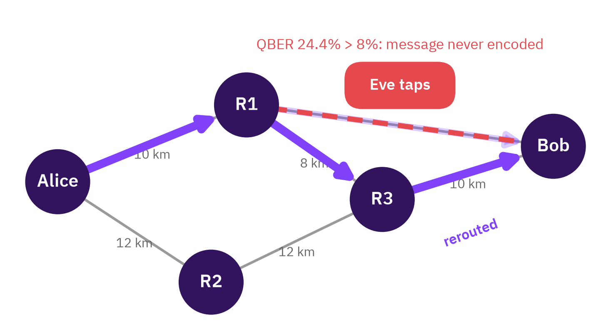
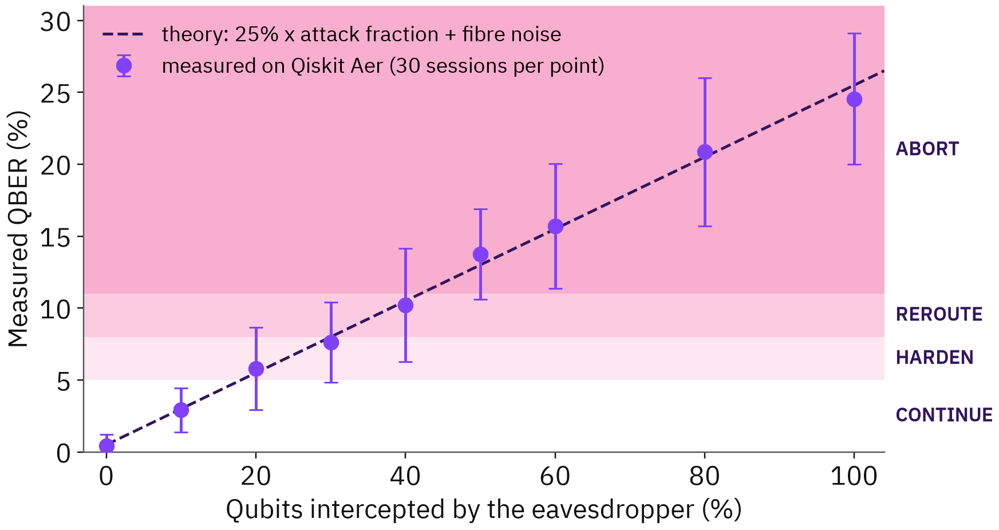
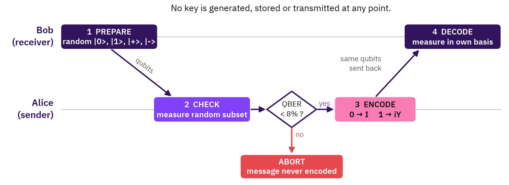
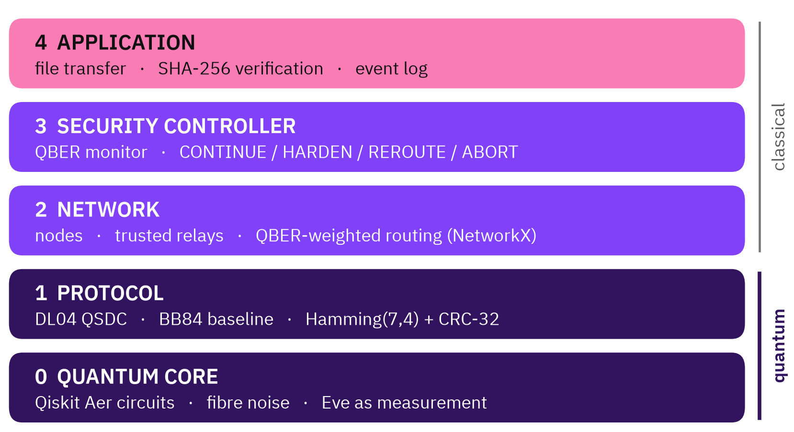

# QSDTS: Quantum Secure Data Transfer System

[](https://colab.research.google.com/github/gowtham472/qsdts/blob/main/notebooks/qsdts_demo.ipynb)
[](https://github.com/gowtham472/qsdts/actions/workflows/ci.yml)

**Keyless quantum-secure file transfer across a multi-hop network.**
Team **DoodleByte** for Q-Hack India 2026, track *Quantum Security & Cryptography*.

QSDTS sends a file where **the message itself is the quantum state**, using the DL04
Quantum Secure Direct Communication protocol. No key is ever generated, stored or
transmitted. Every link checks for an eavesdropper *before* the message is encoded on
it, and when a link is tapped the network routes around it and the file still arrives,
hash-verified.

It runs on Qiskit Aer. **This is a simulation, not a hardware experiment.**



---

## The problem

- Today's key exchange (RSA, elliptic curves) is safe only while factoring and discrete
  logarithms stay slow. Shor's algorithm removes that on a large quantum computer, and
  traffic recorded now can be decrypted then.
- Quantum key distribution protects *key agreement* with physics, but the message still
  travels classically and keys still have to be stored and managed at every node.
- QSDC removes the key entirely, but it exists almost only in optics labs. A 2025 review
  of 11 quantum-network simulators found none that implement it [9].

QSDTS is an open, runnable QSDC network you can execute on a laptop.

---

## Quick start

Requires Python 3.10 or newer.

```bash
git clone https://github.com/gowtham472/qsdts
cd qsdts
python -m venv .venv
source .venv/bin/activate          # Windows: .venv\Scripts\activate
pip install -e ".[dev]"
```

Run the live demo (about 30 seconds):

```bash
python -m qsdts.demo
```

```
1. DL04 on a clean fibre
   check QBER 0.0%  ->  PROCEED
   Bob decodes: 'no key was ever created'  integrity OK

2. Same session, eavesdropper on the fibre
   check QBER 23.5% on 85 sifted bits  ->  ABORT
   message bits ever encoded: 0

3. File transfer across the network, attacked mid-transfer
   414 bytes, 15 frames, eavesdropper switches on at frame 5
   frame  5  ABORT      R1-Bob     QBER  24.4%  ABORT: message never encoded
   frame  5  REROUTE    R1-Bob     QBER  24.4%  R1 routes around R1-Bob via R1-R3-Bob
   ...
   path used: Alice > R1 > Bob
   path used: Alice > R1 > R3 > Bob
   SHA-256 received d663937a8cd13d42b013924c1972e40f...  VERIFIED
   aborts 1, reroutes 1, message bits exposed on aborted sessions: 0
```

Run the tests (40 tests, a couple of minutes):

```bash
pytest
```

Reproduce every number and figure:

```bash
python experiments/run_experiments.py   # about 5 minutes, writes results/results.json
python experiments/figures.py           # redraws results/*.png
```

Seeds are fixed, so a rerun reproduces the same measured values exactly.

Or skip installing: open the **[Colab notebook](https://colab.research.google.com/github/gowtham472/qsdts/blob/main/notebooks/qsdts_demo.ipynb)** and choose *Runtime > Run all*.

---

## Results

All measured on Qiskit Aer. Fibre noise is a depolarizing channel with parameter 0.01
(about 0.5% bit flips per pass).

| What | Result |
|---|---|
| QBER under a full intercept-resend attack, DL04 | **25.27%** over 16,652 check bits (theory 25%, within one standard error) |
| Same attack, BB84 on the same channel | 24.80% over 4,967 check bits |
| Message bits ever placed on a link that failed its check | **0**, across 176 aborted sessions and transfers |
| Files delivered and SHA-256 verified under a mid-transfer attack | **8/8** with adaptive routing, **0/8** without |
| Message bits per qubit prepared | DL04 **0.675**, BB84 + one-time pad 0.374 (1.8x) |
| Message bits per fibre transmission | DL04 0.386, BB84 0.374 (about equal) |

DL04 is 1.8x more efficient per qubit prepared, but sends each qubit twice, so per fibre
transmission the two are about equal. **The advantage is that no key exists, not raw
throughput.**

How strong must an attack be to be caught within one block (30 blocks per point)?

| Qubits intercepted | 0% | 10% | 20% | 30% | 40% | 50% | 60% | 80% | 100% |
|---|---|---|---|---|---|---|---|---|---|
| Mean QBER | 0.4% | 2.9% | 5.8% | 7.6% | 10.2% | 13.7% | 15.7% | 20.9% | 24.5% |
| Blocks stopped | 0% | 0% | 20% | 53% | 63% | 100% | 93% | 100% | 100% |

**An honest limit:** strong attacks are stopped almost every time, but a weak attacker
(20% of qubits or fewer) hides inside fibre noise within a single block. Detecting it
across many blocks is the next research question.



---

## How it works

### DL04, with the abort before the encode



1. **Prepare.** Bob prepares N qubits, each randomly in |0>, |1>, |+> or |->, and sends
   them to Alice.
2. **Check.** Alice measures a random subset in random bases and announces the results.
   Bob compares them with what he prepared and computes the QBER.
3. **Encode**, only if the QBER is below the threshold. Alice encodes each message bit on
   a remaining qubit (I for 0, iY for 1) and sends the block back, mixed with a few
   return-check qubits.
4. **Decode.** Bob measures each qubit in the basis he prepared it in. An unchanged state
   reads 0, a flipped one reads 1.

The security-critical invariant is that **step 3 never runs if step 2 failed.** In
QSDTS that is structural, not a convention. Steps 1 and 2 run as one circuit execution;
Aer saves the quantum state at the end of it (`save_stabilizer`). Only if the classical
decision is PROCEED does a second circuit restore that state (`set_stabilizer`) and
apply the encoding gates. An aborted session returns before a single encoding gate
exists. `tests/test_dl04.py::test_abort_precedes_encoding` counts the gates to prove it.

### The quantum layer

- Every qubit is a real wire in a Qiskit circuit, simulated with Aer's stabilizer
  method. That is exact here: every operation (X, H, Y, measurement) is Clifford, and
  depolarizing noise is a Pauli channel.
- The eavesdropper is a **mid-circuit measurement** in a basis she picks at random. The
  errors she causes come from quantum mechanics, not from a formula. That is why the
  measured 25.27% is a real validation of the model.
- Fibre noise is attached only to an `id` gate standing for the fibre, so every error in
  the simulation comes from the channel or from Eve.

### The network layer



- Each hop is an independent DL04 session through a **trusted relay**, which decodes and
  re-encodes. This is the model every deployed quantum network uses today.
- Every forward check measures that link's QBER. A monitor smooths it per link, and a
  policy acts on it:

  | QBER | Action |
  |---|---|
  | below 5% | CONTINUE |
  | 5% to 8% | HARDEN: check twice as many qubits |
  | 8% to 11% | REROUTE: stop using the link |
  | 11% and above | ABORT: beyond the provable-security bound |

- Routing uses NetworkX with link cost `distance / (1 - QBER/11%)^2`, so traffic leaves
  a degrading link before it has to be cut. Rerouting starts from the node holding the
  frame, so plaintext never crosses the tapped fibre.
- Frames use Hamming(7,4) with CRC-32 per hop (retransmit on failure) and SHA-256 end to
  end.

---

## Repository layout

```
qsdts/
  channel.py      Qiskit Aer channel: fibre noise, eavesdropper, chunked stabilizer runs
  dl04.py         DL04 QSDC, check-before-encode enforced structurally
  bb84.py         BB84 baseline on the same channel
  coding.py       Hamming(7,4) + CRC-32 framing
  network.py      topology, QBER monitor, policy, router, file transfer
  demo.py         the live demo (python -m qsdts.demo)
tests/            40 tests: protocol correctness, the invariant, policy, transfers
experiments/      run_experiments.py (all numbers), figures.py (all charts)
notebooks/        qsdts_demo.ipynb, the Colab demo, and the script that generates it
results/          results.json and every figure used in the presentation
deck/             builds the presentation from results.json (needs the organisers' template)
```

---

## What we do not claim

QSDTS implements published work. We did not invent:

- QSDC or the DL04 protocol [1], [2]
- multi-hop or relayed QSDC, demonstrated in hardware [6], [7]
- eavesdropper-triggered rerouting, demonstrated on the Tokyo QKD Network in 2010 [10]
- BB84 [3]

What we built is an open, runnable implementation of these ideas as a network: protocol,
routing, policy, experiments and evidence, which until now existed in labs or on paper.

### Known limitations

- **Simulation, not hardware.** Calibrating the channel on IBM Quantum hardware is the
  next step.
- **Trusted relays see plaintext**, as in every deployed quantum network. Removing that
  needs quantum repeaters.
- **Idealised physics.** Photon loss, detector dead time and multi-photon pulses are not
  modelled, so photon-number-splitting attacks are out of scope for now.
- **Weak attackers** on 20% of qubits or fewer are not reliably caught within one block.

---

## References

1. F.-G. Deng and G. L. Long, "Secure direct communication with a quantum one-time pad," *Phys. Rev. A* 69, 052319, 2004.
2. G. L. Long and X. S. Liu, "Theoretically efficient high-capacity quantum-key-distribution scheme," *Phys. Rev. A* 65, 032302, 2002.
3. C. H. Bennett and G. Brassard, "Quantum cryptography: Public key distribution and coin tossing," Proc. IEEE ICCSSP, Bangalore, 1984, pp. 175-179.
4. P. W. Shor, "Algorithms for quantum computation: discrete logarithms and factoring," Proc. 35th FOCS, 1994, pp. 124-134.
5. W. K. Wootters and W. H. Zurek, "A single quantum cannot be cloned," *Nature* 299, 802-803, 1982.
6. Z. Qi et al., "A 15-user quantum secure direct communication network," *Light: Sci. Appl.* 10, 183, 2021.
7. M. Wang et al., "Experimental demonstration of secure relay in quantum secure direct communication network," *Entropy* 25, 1548, 2023.
8. S. Zhang and C. Zheng, "Quantum secure direct communication technology-enhanced time-sensitive networks," *Entropy* 27, 221, 2025.
9. R. J. Hayek, J. Chung and R. Kettimuthu, "A review of software for designing and operating quantum networks," arXiv:2510.00203, 2025.
10. M. Sasaki et al., "Field test of quantum key distribution in the Tokyo QKD Network," *Opt. Express* 19, 10387-10409, 2011.

Built with [Qiskit](https://github.com/Qiskit/qiskit), [Qiskit Aer](https://github.com/Qiskit/qiskit-aer), [NetworkX](https://networkx.org), NumPy and Matplotlib.

## Team DoodleByte

Gowtham K (team lead), Pranav A S, Jaya Suriya T R.

## License

Apache 2.0. See [LICENSE](LICENSE).
